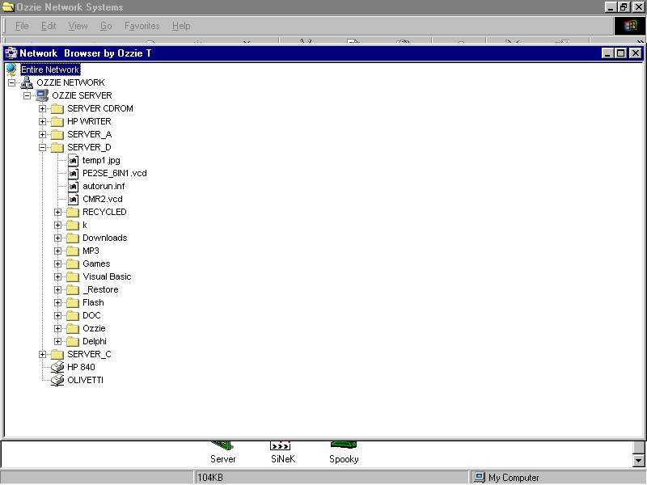



## Network Browser\. The best one onPSC with File browser

### Description

Shows you all computers and shared drivers folders, files and printers on LAN. Incuded file browser. I think it is the best one on PSC. Please send your comments and feedbacks to me for improving it.
 
### More Info
 

             |
---                |---
**Submitted On**   |2001-05-01 20:47:44
**By**             |[Ozzie T](https://github.com/Planet-Source-Code/PSCIndex/blob/master/ByAuthor/ozzie-t.md)
**Level**          |Intermediate
**User Rating**    |4.8 (62 globes from 13 users)
**Compatibility**  |VB 4\.0 \(16\-bit\), VB 4\.0 \(32\-bit\), VB 5\.0, VB 6\.0
**Category**       |[Complete Applications](https://github.com/Planet-Source-Code/PSCIndex/blob/master/ByCategory/complete-applications__1-27.md)
**World**          |[Visual Basic](https://github.com/Planet-Source-Code/PSCIndex/blob/master/ByWorld/visual-basic.md)
**Archive File**   |[Network Br19236552001\.zip](https://github.com/Planet-Source-Code/ozzie-t-network-browser-the-best-one-onpsc-with-file-browser__1-22965/archive/master.zip)

